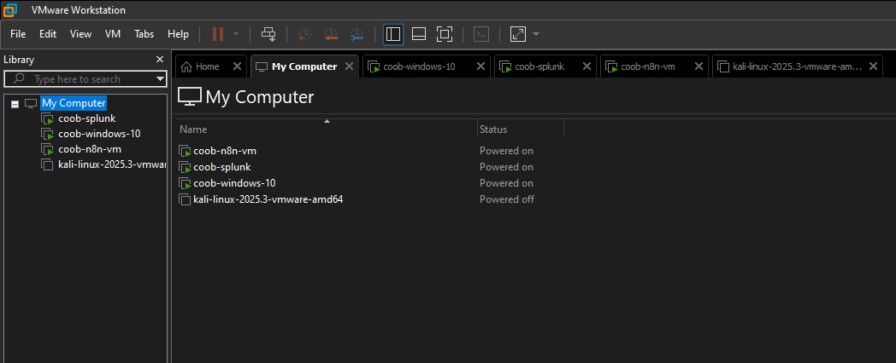
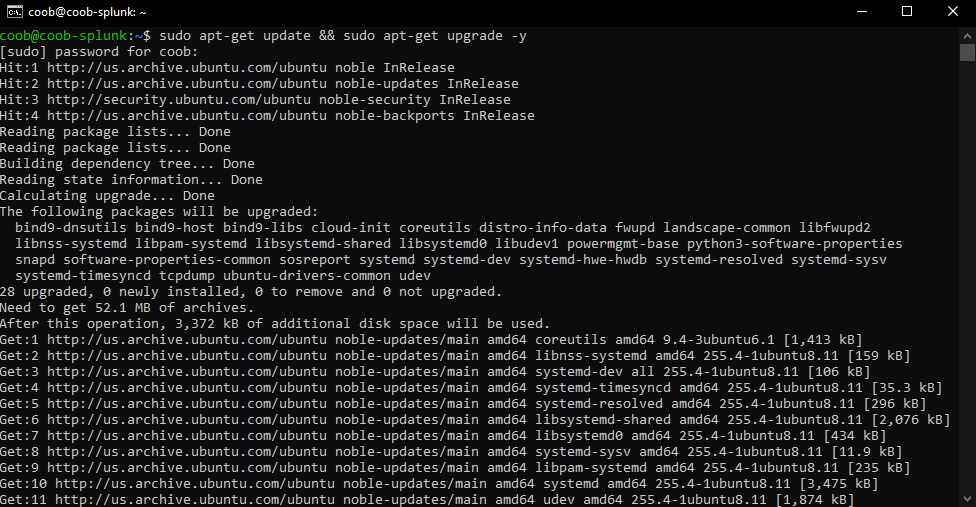

# VM Setup

**VMs to create:** Windows 10, Splunk, Kali, n8n instance

### Actions:
Created four virtual machines.  
1. `coob-windows-10`
2. `coob-splunk`
3. `coob-n8n-vm`
4. `kali-linux-2025`


---

Connected to the `coob-splunk` VM on my local machine with:
```bash
ssh username@ipaddress
```

---

Then updated its packages with:
```bash
sudo apt-get update && sudo apt-get upgrade -y
```
