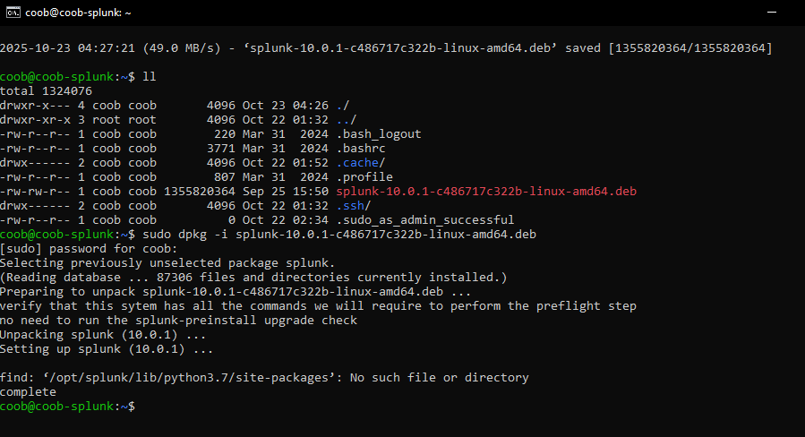
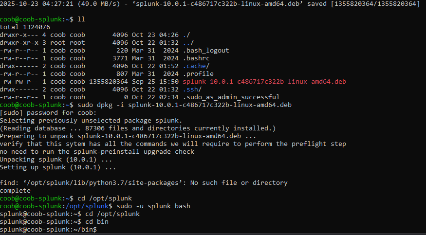

# Splunk Setup

### Actions
Downloaded Splunk through local machine while connected to `coob-splunk` VM  .
Noted down IP address for all the virtual machines.
In the `coob-n8n-vm`, also ran:  
```bash
sudo apt-get update && sudo apt-get upgrade -y
```

To finish Splunk download, ran:
```bash
sudo dpkg -i splunk-10.0.1-c486717c322b-linux-amd64.deb
```


Moved into Splunk directory:
```bash
cd /opt/splunk
```

Changed into splunk user:
```bash
sudo -u splunk bash
```

Then moved back into the /opt/splunk directory and entered the bin directory:
```bash
cd bin
```


Then ran:
```bash
splunk start
```

Enabled Splunk auto start:
```bash
sudo ./splunk enable boot-start -user splunk
```
Then connected to the `coob-splunk` vm using the vm's IP and port number.