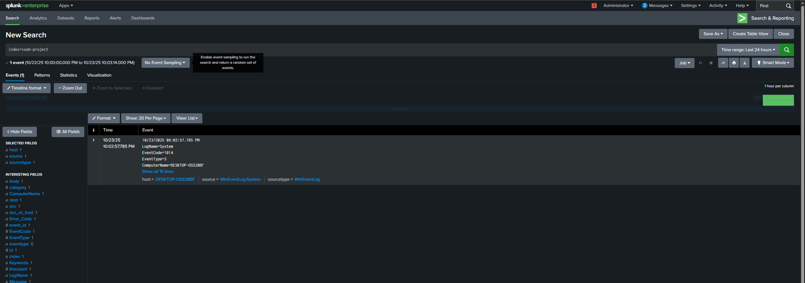

# Windows Telemetry Forwarder Setup

### Actions
Set listening port to 9997.
Created new index called `coob-project`
Installed Splunk Add-on for Microsoft Windows.
Configured Windows machine to send telemetry to Splunk.  
Pinged `coob-splunk` from `coob-windows-10` VM to confirm communication.  

---

Downloaded Splunk Universal Forwarder in `coob-windows-10`.

---

In `SplunkUniversalForwarder/etc/system/local`, the `inputs.conf` file was missing.  
Downloaded it so `coob-windows-10` can send telemetry to Splunk.  

---

Windows successfully sends telemetry to Splunk.  
