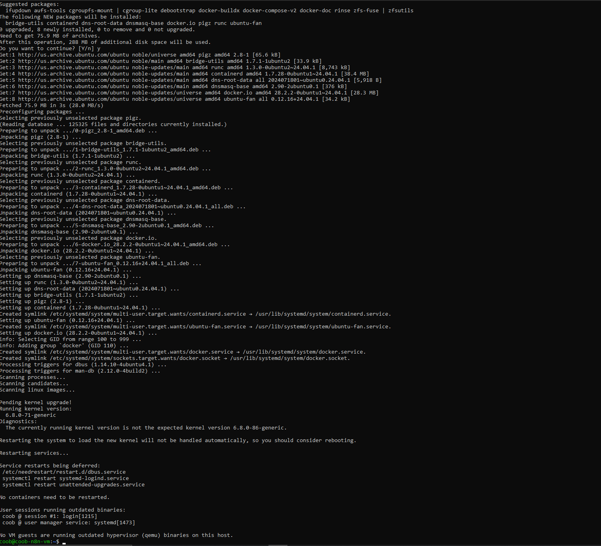
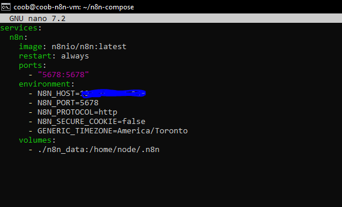
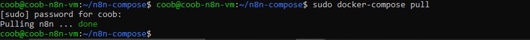
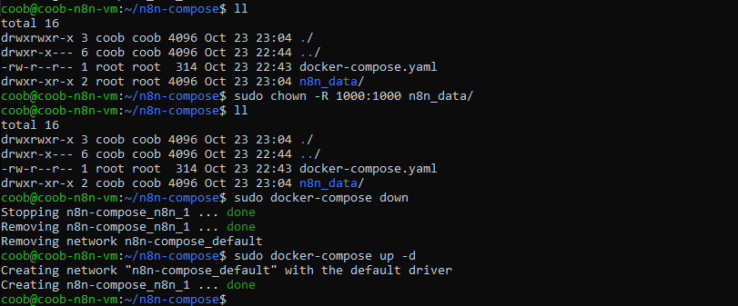
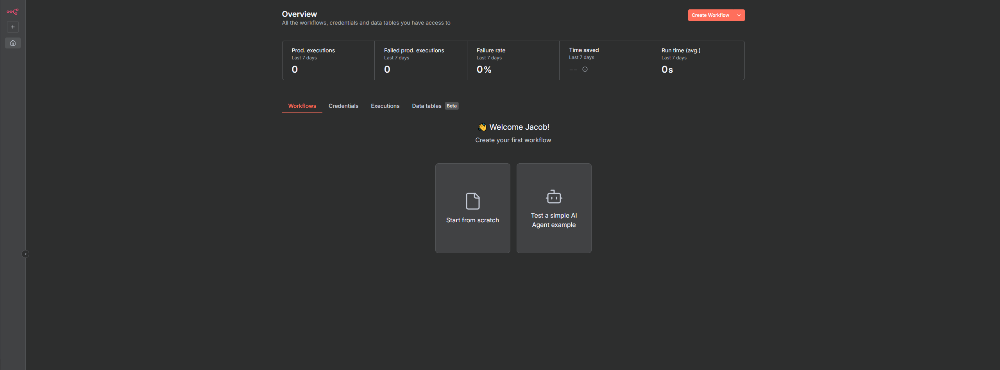

# n8n Docker Setup

### Actions:
Connected to `coob-n8n-vm` from local machine via SSH.  
Installed Docker:
```bash
sudo apt install docker.io
```


---

Installed Docker Compose:
```bash
sudo apt install docker-compose
```

---

Started installing n8n and created a directory:
```bash
mkdir n8n-compose
cd n8n-compose
```

---

Then created a new file `docker-compose.yaml`.

`docker-compose.yaml` setup contains:
1. Download latest n8n image
2. Run as service on port 5678
3. Use environment variables for host, timezone, and cookie settings
4. Store persistent workflow data locally
5. Automatically restart if stopped


---

Then ran:

```bash
sudo docker-compose pull
sudo docker-compose up -d
```


---

Wasn't able to access n8n instance because of permission issue (set to root).
Fixed this issue with:
```bash
sudo chown -R 1000:1000 n8n_data/
```


---

After changing permissions, gained access to n8n instance and took a snapshot of `coob-n8n-vm`
