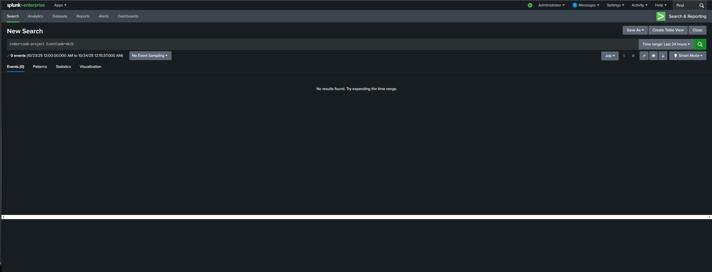
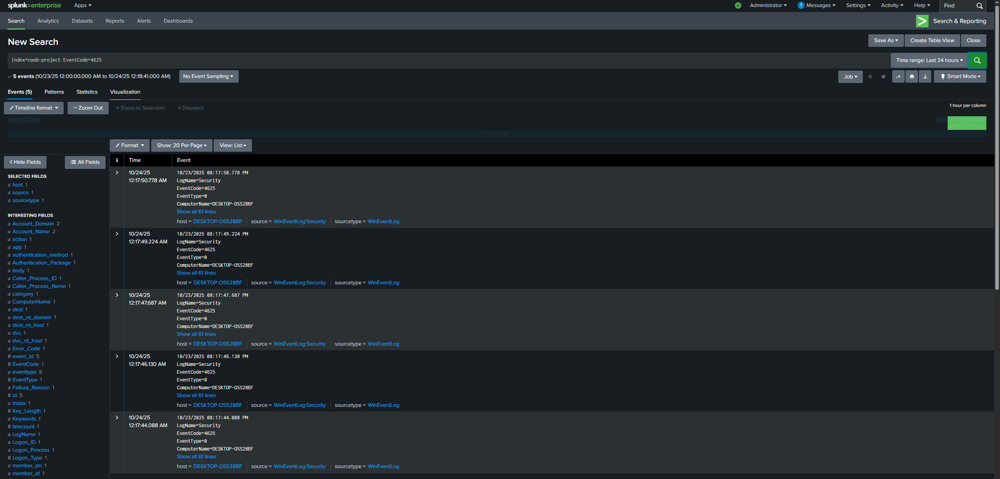
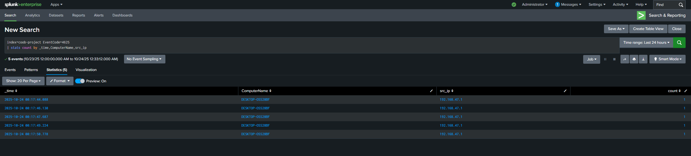
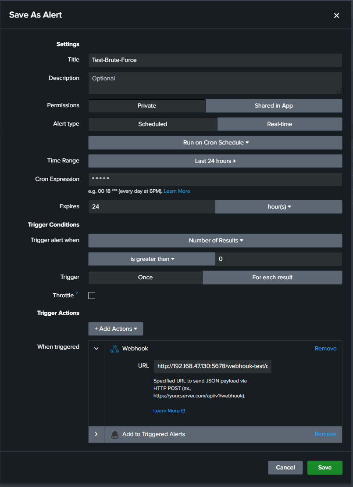
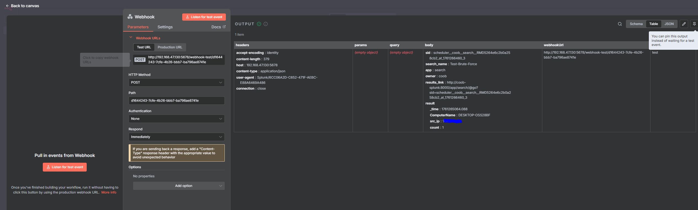

# Splunk Alert Integration with n8n
 
### Actions:
Created alert in Splunk to ensure n8n webhook can catch it.  

---

Generated failed attempts by trying to RDP into Windows machine.  

Before failed attempts:  
  

After failed attempts:  
  

---

Filtered down to only certain fields.  

---

Created Splunk alert with n8n Webhook to catch the alert.  

---

n8n instance successfully caught Splunk alert.  
