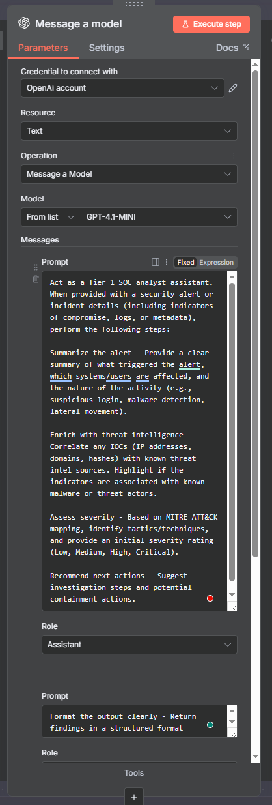
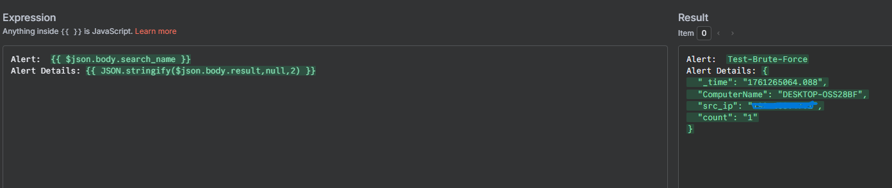
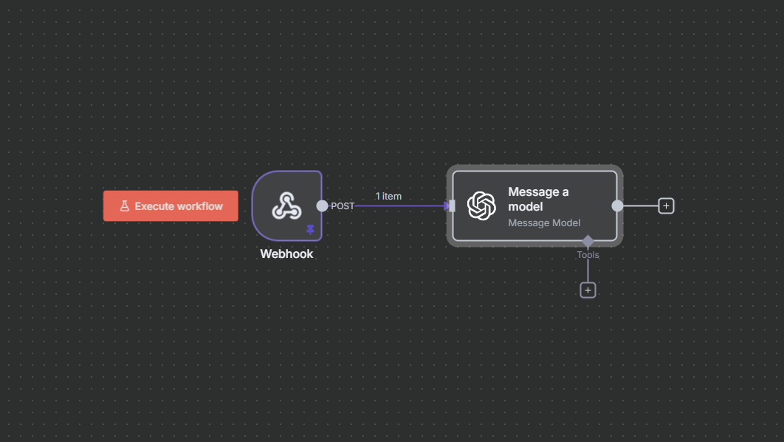
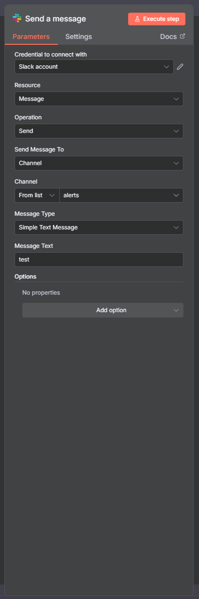
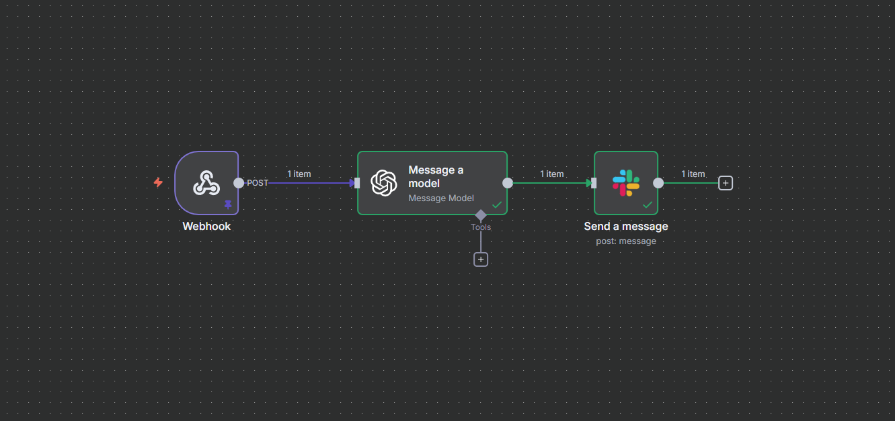
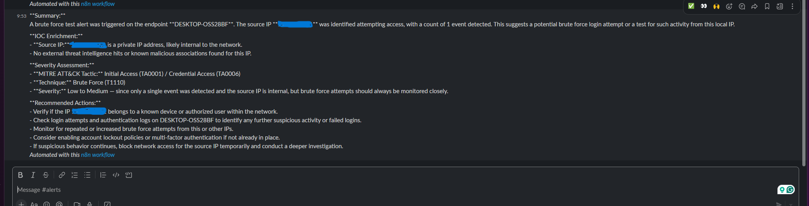

# OpenAI and Slack Integration

### Actions:
Created automation workflow in n8n.  
- Added **OpenAI Message Model**
- Connected OpenAI account with n8n
- Created three roles:
  - **Assistant** with its own prompt
  - **System** with its own prompt  
  - **User** with its own prompt
Using **GPT-4.1-MINI** model.  

The **User** role provides the alert type and details so it includes all fields.  

Connected `Webhook` → `Message a Model`  

---

Created **Slack workspace** and `alerts` channel.  

---
 
Connected Slack to n8n workflow.  

---
 
Ran “OpenAI Message Model” -> “Slack Message” applications in workflow.  
Tested connection successfully.  
Gave the expected output in Slack.

